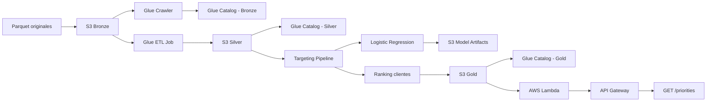

# Physical Debit Card Pilot — Data Science Technical Assessment

Solución end-to-end para analizar un piloto de entrega de tarjetas de débito físicas y construir un criterio replicable de priorización para una siguiente ola de clientes.

**Flujo:** ingesta → estandarización → enriquecimiento → análisis del piloto → modelado → priorización → disponibilización  
**Stack:** Python, Amazon S3, AWS Glue, AWS Lambda, Amazon API Gateway

---

## 1. Contexto

Un banco entregó tarjetas de débito físicas a un grupo de clientes con la hipótesis de que tener una tarjeta física en la mano incrementa la frecuencia y el monto de las transacciones.

A partir de cinco datasets sintéticos con problemas de calidad intencionales, el objetivo fue responder:

1. **¿Cómo le fue al piloto?**
   - adopción;
   - activación;
   - comportamiento transaccional;
   - comparación entre clientes con y sin tarjeta física.

2. **¿A quién priorizar en la siguiente ola?**
   - el presupuesto de tarjetas es limitado;
   - se necesita un criterio reproducible;
   - la decisión debe ser defendible tanto técnica como comercialmente.

El ejercicio se abordó mediante un pipeline completo, reproducible y con una complejidad de modelado proporcional al problema.

---

## 2. Resumen ejecutivo

### Resultado del piloto

| Indicador | Resultado |
| --- | ---: |
| Tarjetas físicas emitidas | 5,382 |
| Tarjetas físicas activadas | 2,573 (**47.81%**) |
| Mediana emisión → activación | 12 días |
| Percentil 95 de tiempo de activación | 23 días |
| Δ transacciones/cliente — tratado vs. control | +2.78 vs. +0.60 |
| Δ días activos/cliente — tratado vs. control | +2.48 vs. +0.45 |
| Δ volumen transaccionado/cliente — tratado vs. control | +48.53 vs. +17.83 USD |

**Lectura de negocio:** los clientes que recibieron tarjeta física muestran una mejora transaccional posterior considerablemente mayor que el grupo de comparación (`virtual_only`).

Los grupos ya presentaban diferencias antes del piloto, con SMD aproximadamente entre 0.15 y 0.18. Por esta razón, el resultado se interpreta como una **asociación observacional favorable** y se mantienen explícitas las limitaciones para atribuir causalidad.

La activación representa además un punto importante de pérdida: más de la mitad de las tarjetas físicas emitidas no presenta activación.

### Recomendación para la siguiente ola

Se construyó un **ranking de propensión a activación** que permite ajustar la profundidad de selección al presupuesto disponible.

| Estrategia | Activation rate Top 10% | Lift |
| --- | ---: | ---: |
| Población general | 47.22% | 1.00x |
| Baseline (`tx_count`) | 54.08% | 1.15x |
| **Logistic Regression** | **68.37%** | **1.45x** |

**Recomendación:** utilizar `priority_rank` y `priority_decile` como criterio inicial de asignación, comenzando por el decil 10 y expandiendo la población según el número de tarjetas disponibles.

En una siguiente ola convendría reservar, cuando sea viable, una porción de asignación aleatoria. Esto permitiría medir incrementalidad con mayor rigor y evolucionar posteriormente hacia un enfoque de uplift.

---

## 3. Arquitectura

Se implementó una arquitectura tipo **Medallion**:



**Bucket principal:** `bg-ds-debit-card-pilot-bucket`  
**Región:** `us-east-1`

```text
bronze/
├── cards/
├── customers/
├── marketing_interactions/
├── merchant_catalog/
└── transactions/

silver/
├── cards/
├── customers/
├── marketing_interactions/
├── merchant_catalog/
└── transactions/

gold/
└── customer_targeting/
    ├── customer_targeting.parquet
    └── customer_targeting.csv

artifacts/
└── models/
    └── targeting_pipeline.joblib
```

### Bronze

Copia inmutable de los datos originales entregados para la prueba.

### Silver

Contiene datos:

- tipificados;
- deduplicados cuando existe evidencia suficiente;
- con categorías homologadas;
- con fechas estandarizadas;
- con indicadores de calidad e integridad referencial.

Ejemplos:

```text
is_orphan_customer
is_uncatalogued_merchant
```

Los flags permiten conservar trazabilidad sobre anomalías detectadas durante el procesamiento.

### Gold

Contiene el producto final de priorización:

```text
gold/customer_targeting/customer_targeting.parquet
```

Se publica adicionalmente una versión CSV:

```text
gold/customer_targeting/customer_targeting.csv
```

El CSV permite un consumo ligero desde AWS Lambda utilizando únicamente librerías estándar y `boto3`.

### AWS Glue

Se utilizó una única database:

```text
debit_card_pilot
```

Se configuraron crawlers para:

- Bronze;
- Silver;
- Gold.

El job:

```text
debit-card-pilot-bronze-to-silver
```

ejecuta la estandarización de Bronze hacia Silver mediante AWS Glue 5.x y Spark.

---

## 4. Calidad de datos: problemas encontrados y decisiones

| Problema detectado | Decisión |
| --- | --- |
| Duplicados exactos en Customers, Cards y Transactions | Eliminados; las claves quedan consistentes luego del dedup |
| Cédulas asociadas a distintos `cliente_id` (~60 casos con atributos diferentes) | Se mantienen separadas; `cliente_id` se utiliza como identificador operacional |
| Registros cuyo cliente no existe en el maestro | Se conservan con `is_orphan_customer` |
| Comercios no presentes en catálogo (`COM-998`, `COM-999`) | Se conservan con `is_uncatalogued_merchant` |
| Pseudo-nulos (`"nan"`, `"null"`, `"n/a"`, `""`) | Homologados a nulo real |
| Fechas en formatos mixtos, incluyendo epoch ms/s | Conversión tolerante; valores no recuperables permanecen nulos |
| Categorías inconsistentes (`F` / `fisica` / `física`, `Cash In` / `cash_in`) | Homologadas a valores canónicos |
| Montos con símbolos y formatos heterogéneos | Normalizados a formato numérico |
| Montos negativos | Conservados porque su semántica no está suficientemente documentada para tratarlos como errores |

**Principio general:** aplicar transformaciones únicamente cuando exista evidencia suficiente para justificarlas.

Las anomalías sin una fuente de verdad clara se conservan y documentan mediante flags o decisiones explícitas dentro del análisis.

---

## 5. Enfoque de modelado

### 5.1 Definición del piloto

La cohorte de tratamiento se define a partir de:

```text
tarjetas.fecha_emision
```

de la tarjeta física.

La campaña de marketing se descartó como fuente de definición del piloto debido a su baja alineación temporal con la emisión:

- aproximadamente 43.7% de los clientes con tarjeta física tiene algún solapamiento con la campaña;
- la mediana entre el contacto previo más cercano y la emisión es aproximadamente 812 días;
- alrededor de 1.02% presenta contacto dentro de los 30 días previos a la emisión.

`fecha_emision` constituye por tanto la evidencia más directa disponible para identificar la exposición al piloto.

### Comparación del piloto

La comparación principal utiliza:

```text
physical_and_virtual
```

como grupo tratado y:

```text
virtual_only
```

como grupo de referencia.

Ambos grupos comparten la tenencia de una tarjeta virtual y se diferencian principalmente por la presencia adicional de una tarjeta física. Las diferencias previas observadas entre las poblaciones se consideran al interpretar los resultados.

---

### 5.2 Target

El target se define como:

```text
1 = activa la tarjeta física dentro de 30 días
0 = no la activa dentro de 30 días
```

La ventana de 30 días se eligió porque:

- la mediana de activación es aproximadamente 12 días;
- el percentil 95 se encuentra alrededor de 23 días;
- las activaciones observadas ocurren dentro de un horizonte relativamente corto.

### Activación como outcome

La tabla de transacciones contiene:

```text
cliente_id
```

pero no contiene:

```text
tarjeta_id
```

Cuando un cliente posee tarjeta física y virtual, los datos disponibles no permiten atribuir con certeza una transacción a una tarjeta específica.

Por esta razón, la activación se utiliza como el outcome observable y defendible disponible en el ejercicio.

---

### 5.3 Features

Las features se construyen utilizando una ventana de:

```text
60 días
```

previos a la fecha de referencia de cada cliente.

#### Transaccionales

```text
tx_count
total_amount
active_days
avg_amount
recency_days
```

- `tx_count`: número de transacciones.
- `total_amount`: volumen absoluto transaccionado.
- `active_days`: días distintos con actividad.
- `avg_amount`: monto absoluto promedio por transacción.
- `recency_days`: días desde la última transacción.

#### Cliente

```text
age
tenure_days
ciudad
canal_adquisicion
```

#### Variables excluidas

Los siguientes campos se excluyen de las variables predictivas:

```text
cedula
nombre
cliente_id
```

`cliente_id` se conserva únicamente como llave operacional del resultado.

También se excluye:

```text
estado_cuenta
```

porque el dataset no documenta claramente su fecha de observación. Incorporar un estado observado posteriormente al evento histórico podría introducir **data leakage**.

Las interacciones de marketing tampoco se utilizan como features debido a las inconsistencias temporales identificadas durante el análisis.

---

### 5.4 Fecha de scoring

Para los candidatos se utiliza:

```text
2026-05-01
```

como fecha de snapshot.

La cobertura transaccional cae drásticamente a partir de julio de 2026:

```text
May 2026: 16,323 transacciones
Jun 2026: 25,318 transacciones
Jul 2026:    910 transacciones
Aug 2026:    112 transacciones
Sep 2026:    107 transacciones
```

Utilizar los últimos meses habría generado features artificialmente bajas debido a incompletitud de la fuente.

Mayo fue seleccionado porque:

1. presenta cobertura suficiente;
2. coincide aproximadamente con la mediana de emisión del grupo tratado;
3. mejora la comparabilidad temporal entre entrenamiento y scoring.

Este snapshot permite reproducir el ejercicio bajo una cobertura consistente. En producción se utilizaría la fecha más reciente cuyas fuentes hayan superado controles de completitud.

---

## 6. Modelo

Se utilizó:

```text
Logistic Regression
```

sobre un pipeline de `scikit-learn`.

### Variables numéricas

```text
SimpleImputer(strategy="median")
StandardScaler()
```

### Variables categóricas

```text
SimpleImputer(strategy="most_frequent")
OneHotEncoder(handle_unknown="ignore")
```

### Modelo

```text
LogisticRegression(max_iter=1000)
```

### ¿Por qué Logistic Regression?

Se priorizaron:

- interpretabilidad;
- estabilidad;
- reproducibilidad;
- bajo costo operacional;
- facilidad de deployment;
- generación directa de probabilidades para construir un ranking.

La Regresión Logística permite además explicar las principales asociaciones del modelo frente a negocio y facilita su integración dentro del pipeline.

Su aporte se validó frente a un baseline transaccional sencillo.

---

## 7. Baseline y evaluación

Se construyó un baseline utilizando:

```text
tx_count
```

La regla representa un criterio intuitivo de negocio:

> priorizar clientes con mayor frecuencia transaccional reciente.

### Resultados

| Métrica | Resultado |
| --- | ---: |
| ROC-AUC | 0.629 |
| Activation rate general | 47.22% |
| Activation rate Top 10% baseline | 54.08% |
| Lift Top 10% baseline | 1.15x |
| Activation rate Top 10% modelo | **68.37%** |
| Lift Top 10% modelo | **1.45x** |
| Activaciones capturadas en Top 30% | 38.34% |

El ROC-AUC muestra una capacidad de discriminación moderada.

Para este problema, la restricción principal está asociada al número limitado de tarjetas. El valor comercial del modelo se concentra especialmente en su capacidad para ordenar la población y concentrar clientes con mayor propensión en los primeros niveles del ranking.

Por ello, el lift y la tasa de activación por profundidad tienen una interpretación directa para negocio.

### Interpretabilidad

Entre las asociaciones positivas encontradas por el modelo aparecen:

- canal de adquisición `referido`;
- ciudad Quito;
- mayor número de días activos;
- mayor antigüedad.

Entre las asociaciones negativas aparecen:

- mayor edad;
- determinados canales de adquisición;
- determinadas ciudades.

Estos resultados se interpretan como **asociaciones condicionales del modelo**. No representan efectos causales individuales de las variables.

---

## 8. Poblaciones finales

Luego de aplicar las reglas de temporalidad y elegibilidad:

```text
Training population: 4,860 clientes
Candidate population: 5,920 clientes
```

Después de seleccionar el modelo mediante holdout, el pipeline final se reentrena utilizando la totalidad de los 4,860 clientes etiquetados.

El modelo final se aplica posteriormente sobre los 5,920 candidatos elegibles `virtual_only`.

El resultado contiene:

```text
cliente_id
priority_score
priority_rank
priority_decile
```

El caso no especifica una cantidad fija de tarjetas disponibles, por lo que el output conserva el ranking completo.

Esto permite a negocio utilizar diferentes profundidades según presupuesto:

- Top N;
- Top 10%;
- decil 10;
- deciles 10–9;
- cualquier corte compatible con la disponibilidad de tarjetas.

---

## 9. Disponibilización

El caso de uso corresponde a una **decisión batch por cohortes**.

El ranking calculado se disponibiliza mediante una API ligera:

```text
Gold S3
   ↓
AWS Lambda
   ↓
API Gateway - HTTP API
   ↓
GET /priorities?limit=N
```

Ejemplo:

```http
GET /priorities?limit=5
```

Respuesta:

```json
[
  {
    "cliente_id": "CHK-006247",
    "priority_score": 0.890416,
    "priority_rank": 1,
    "priority_decile": 10
  }
]
```

La función se encuentra versionada en:

```text
src/debit_card_pilot/api/lambda_function.py
```

La Lambda:

1. lee `customer_targeting.csv` desde Gold;
2. obtiene el parámetro `limit`;
3. selecciona los primeros N clientes;
4. devuelve el resultado como JSON.

El CSV mantiene la función ligera utilizando únicamente `boto3` y librerías estándar.

El resultado analítico principal se conserva además en Parquet:

```text
s3://bg-ds-debit-card-pilot-bucket/gold/customer_targeting/customer_targeting.parquet
```

y se encuentra catalogado mediante AWS Glue.

---

## 10. Estrategia de serving

La asignación de tarjetas ocurre por cohortes, por lo que el scoring se ejecuta en batch.

El flujo operacional es:

```text
datos actualizados
      ↓
feature engineering
      ↓
scoring batch
      ↓
ranking Gold
      ↓
API de consumo
```

La API desacopla al equipo consumidor del pipeline de Data Science y permite consultar directamente la lista priorizada.

Un servicio de inferencia online requeriría disponer en tiempo real de las mismas features utilizadas por el modelo. Esa complejidad adicional no aporta una ventaja relevante para la dinámica actual de asignación por olas.

---

## 11. Estructura del repositorio

```text
notebooks/
├── 01_data_profiling.ipynb
├── 02_pilot_analysis.ipynb
└── 03_targeting_model.ipynb

src/debit_card_pilot/
├── config.py
│
├── etl/
│   └── bronze_to_silver.py
│
├── features/
│   └── targeting_features.py
│
├── targeting/
│   ├── population.py
│   ├── train.py
│   ├── score.py
│   ├── publish.py
│   └── run.py
│
└── api/
    └── lambda_function.py
```

Los notebooks documentan:

- exploración;
- decisiones;
- análisis;
- resultados.

La lógica reutilizable y operacional se encuentra dentro de `src/`.

`run.py` orquesta el flujo completo:

```text
Silver
  ↓
Population
  ↓
Features
  ↓
Training
  ↓
Scoring
  ↓
Gold + Model Artifact
```

---

## 12. Cómo ejecutar

### Crear ambiente

```powershell
python -m venv .venv
.venv\Scripts\Activate.ps1
```

### Instalar dependencias

```powershell
pip install -r requirements.txt
pip install -e .
```

### Configurar AWS CLI

Durante el desarrollo se utilizó:

```text
ds-technical-test
```

```powershell
aws configure --profile ds-technical-test
```

Las credenciales AWS no se almacenan en el repositorio.

### Ejecutar targeting

Una vez disponible Silver en S3:

```powershell
python -m debit_card_pilot.targeting.run
```

Output esperado:

```text
Training customers: 4,860
Scored candidates: 5,920
Parquet published: s3://...
CSV published: s3://...
Model published: s3://...
```

---

## 13. Notebooks

### `01_data_profiling.ipynb`

Contiene:

- perfilamiento estructural;
- duplicados;
- integridad referencial;
- pseudo-nulos;
- fechas;
- categorías;
- decisiones Bronze → Silver.

### `02_pilot_analysis.ipynb`

Contiene:

- definición del piloto;
- activación;
- cohortes;
- temporalidad;
- comparabilidad;
- comportamiento pre/post;
- conclusiones del piloto.

### `03_targeting_model.ipynb`

Contiene:

- definición del target;
- población de entrenamiento;
- población candidata;
- feature engineering;
- baseline;
- entrenamiento;
- evaluación;
- lift;
- interpretabilidad;
- priorización final.

Los notebooks funcionan como evidencia analítica y narrativa del proceso.

---

## 14. Limitaciones

### Evidencia observacional

La comparación entre clientes con y sin tarjeta física es observacional.

Los grupos ya presentaban diferencias antes del piloto. Esta característica limita la capacidad de atribuir toda la mejora observada específicamente a la entrega de la tarjeta física.

### Propensión e incrementalidad

El score estima la probabilidad de activación después de recibir una tarjeta física.

Una pregunta diferente sería estimar cuánto cambia la probabilidad de activación o el comportamiento del cliente específicamente por recibir la tarjeta.

Ese segundo objetivo corresponde a incrementalidad/uplift.

El piloto no documenta un mecanismo de asignación que permita estimar esa incrementalidad con suficiente confianza. Una siguiente ola con asignación parcialmente aleatoria permitiría evolucionar hacia ese enfoque.

### Sesgo de selección

El modelo se entrena utilizando clientes que históricamente recibieron una tarjeta física.

Si existió un criterio previo de asignación no documentado, la población de entrenamiento podría diferir sistemáticamente de la población completa `virtual_only`.

### Activación como target

La activación puede capturar una combinación de:

- intención del cliente;
- proceso de entrega;
- experiencia en la aplicación;
- comunicación;
- soporte;
- fricción operacional.

Por lo tanto, debe interpretarse como un outcome operacional de adopción.

### Sin atribución tarjeta ↔ transacción

Las transacciones no contienen `tarjeta_id`.

Los datos disponibles impiden identificar con certeza si una transacción posterior fue realizada con la tarjeta física o virtual cuando el cliente posee ambas.

### Cobertura temporal

La densidad transaccional cae considerablemente desde julio de 2026.

Por ello se utiliza un snapshot histórico con cobertura suficiente para construir las features de manera consistente.

---

## 15. Decisiones y trade-offs clave

### Glue con Spark para un volumen pequeño

El volumen del ejercicio no requiere Spark desde una perspectiva estrictamente computacional.

AWS Glue permite centralizar el ETL dentro de una arquitectura gestionada, reproducible e integrada con S3 y Data Catalog.

Para un volumen productivo similar también sería razonable evaluar una alternativa Python más ligera en función de:

- costo;
- frecuencia de ejecución;
- volumen;
- crecimiento esperado.

### Scoring batch y API ligera

La asignación de tarjetas ocurre por olas y permite ejecutar el scoring como proceso batch.

El ranking final se disponibiliza mediante una API ligera para facilitar su consumo por otro equipo sin exponer la lógica interna del pipeline.

### Propensión como primera estrategia de targeting

El modelo de propensión proporciona un ranking interpretable y reproducible a partir de la evidencia disponible.

La estimación de uplift requiere un diseño experimental o un mecanismo de asignación suficientemente conocido para separar con mayor confianza el comportamiento natural del cliente del efecto incremental de la tarjeta.

### Un único Glue Job

Se utilizó un job modularizado para procesar las distintas tablas.

Para el tamaño y alcance del ejercicio, esta estructura simplifica la operación y mantiene la separación lógica dentro del código.

---

## 16. Próximos pasos

Con nuevas iteraciones se podría avanzar hacia:

- experimentación con asignación parcialmente aleatoria;
- uplift modeling;
- challenger models como Random Forest, XGBoost o LightGBM;
- monitoreo de PSI y drift;
- activation rate y lift por decil;
- controles automáticos de completitud temporal;
- separación entre training job y scoring job;
- model registry;
- versionado formal de modelos;
- orquestación mediante Step Functions, Glue Workflows o Airflow.

La complejidad adicional debería incorporarse cuando exista una mejora medible frente a la solución base o una necesidad operacional que la justifique.

---

## 17. Conclusión

El pipeline implementado recorre el flujo completo:

```text
Raw Parquet
    ↓
S3 Bronze
    ↓
AWS Glue
    ↓
S3 Silver
    ↓
Pilot Analysis
    ↓
Feature Engineering
    ↓
Logistic Regression
    ↓
Customer Ranking
    ↓
S3 Gold
    ↓
Glue Catalog
    ↓
AWS Lambda
    ↓
API Gateway
```

Las etapas principales fueron ejecutadas y verificadas directamente en AWS.

El piloto muestra una **señal favorable de mayor actividad transaccional tras la entrega de la tarjeta física**, manteniendo explícitas las limitaciones causales del análisis.

Para la siguiente ola se propone un ranking de propensión a activación que:

- supera al baseline;
- genera lift accionable para negocio;
- conserva interpretabilidad;
- permite adaptar la selección al presupuesto;
- es reproducible;
- se integra al pipeline completo;
- persiste el resultado en S3;
- queda disponibilizado para consumo tecnológico mediante una API AWS.

La solución transforma datos con problemas de calidad en una decisión de negocio reproducible y defendible. El modelo mejora el baseline, concentra mejor a los clientes con mayor propensión de activación y entrega un resultado integrado y consumible dentro de AWS.